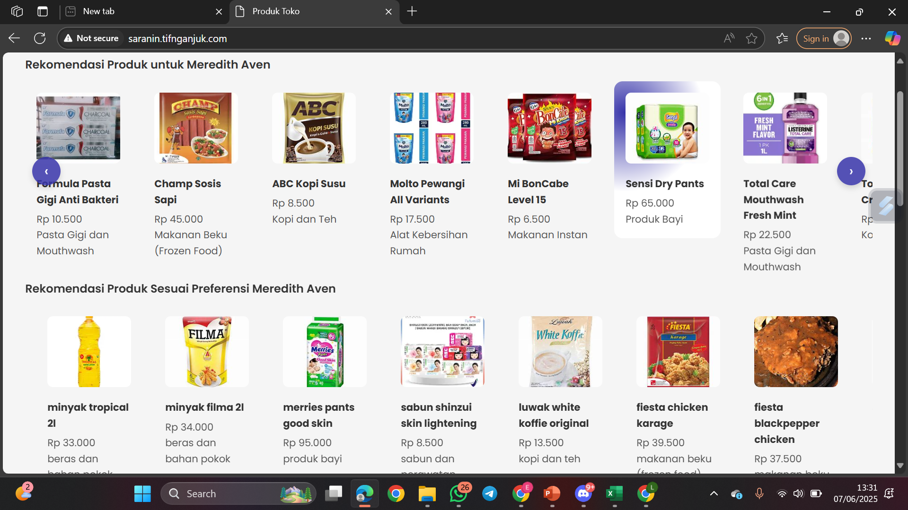
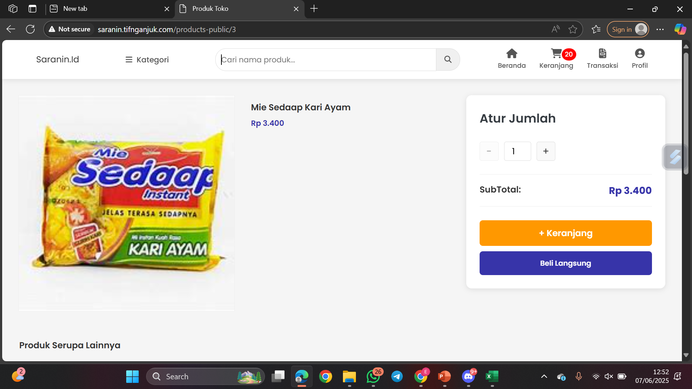
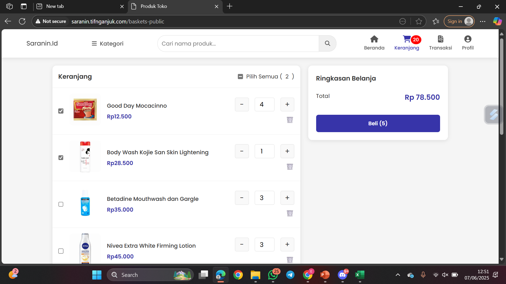
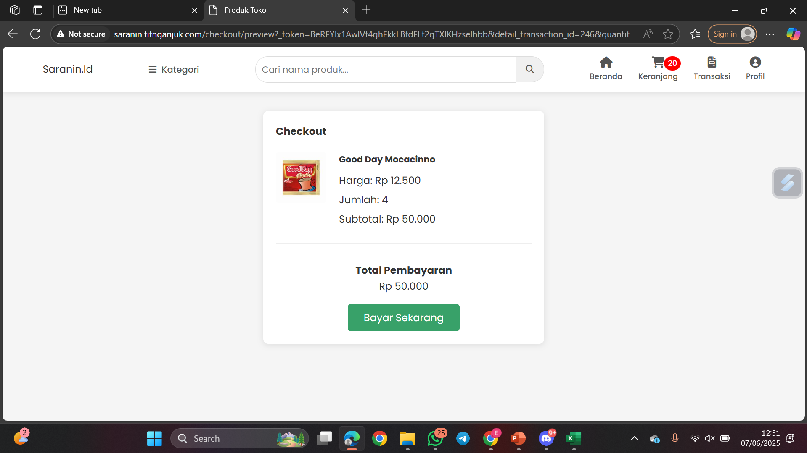
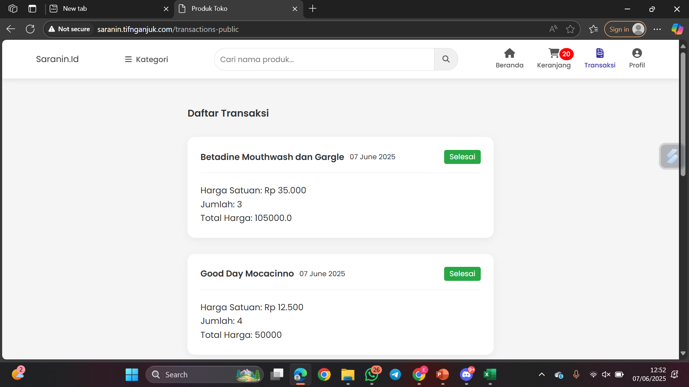
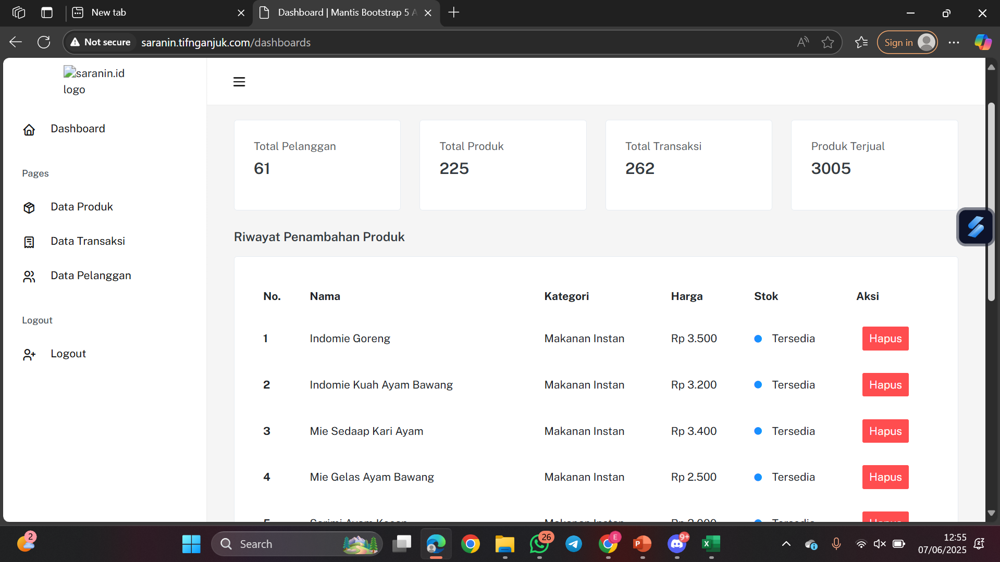
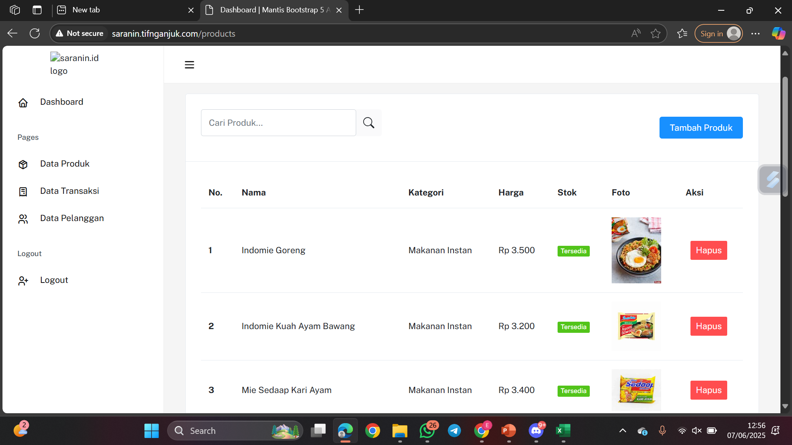
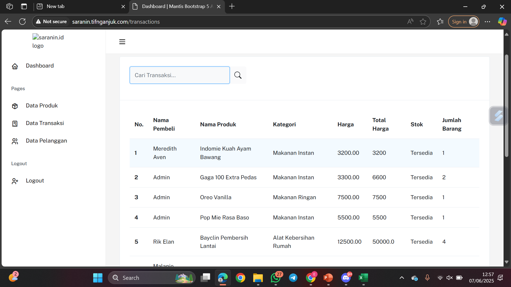
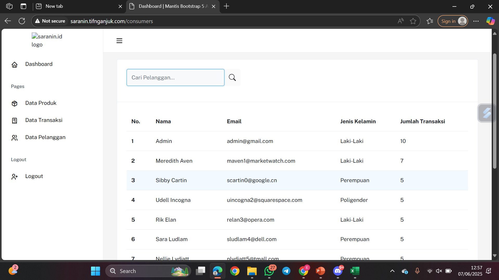

# 🛒 Saranin - Product Supermarket Recommendation

## Tujuan Proyek

Proyek ini adalah untuk mengembangkan sebuah sistem rekomendasi produk berbasis machine learning yang dapat membantu pelanggan supermarket dalam menemukan produk secara lebih cepat, efisien, dan personal. Sistem ini diharapkan mampu mengurangi waktu yang dibutuhkan pelanggan untuk mencari produk di rak-rak supermarket, serta mengatasi kebingungan yang sering muncul saat pelanggan tidak memiliki daftar belanja yang jelas. Dengan memanfaatkan data perilaku belanja pelanggan lain yang memiliki kesamaan preferensi, sistem ini akan memberikan saran produk yang relevan dan meningkatkan pengalaman berbelanja secara keseluruhan. Selain itu, sistem ini juga bertujuan untuk meningkatkan kepuasan pelanggan dan efisiensi operasional supermarket melalui integrasi teknologi yang cerdas dan adaptif.

---

## Deskripsi Proyek

Pelanggan supermarket modern cenderung memiliki gaya hidup yang cepat dan efisien, namun sering menghadapi kendala dalam menemukan produk yang mereka butuhkan di tengah banyaknya pilihan yang tersedia. Tanpa daftar belanja yang terstruktur, pelanggan sering kali merasa bingung dan membuang banyak waktu selama proses belanja. Hal ini menciptakan kesenjangan antara kebutuhan akan pengalaman belanja yang cepat dengan kenyataan di lapangan.

Untuk mengatasi masalah tersebut, proyek ini akan membangun sistem rekomendasi produk berbasis machine learning yang dapat memberikan saran produk secara personalisasi kepada setiap pelanggan. Sistem ini menggunakan pendekatan seperti collaborative filtering atau content-based filtering, dengan mempertimbangkan preferensi dan perilaku pelanggan lain yang serupa. Model machine learning akan diimplementasikan dalam bentuk REST API menggunakan framework Flask, sementara aplikasi web dibangun menggunakan Laravel. Melalui integrasi ini, sistem dapat memberikan hasil rekomendasi secara real-time yang langsung ditampilkan kepada pengguna dalam antarmuka aplikasi Laravel, sehingga proses belanja menjadi lebih terarah, cepat, dan menyenangkan.

## Fitur Utama 💡

- Rekomendasi produk yang dipersonalisasi berdasarkan pola kebiasaan pengguna lain yang memiliki preferensi serupa.
- Rekomendasi produk yang dipersonalisasi berdasarkan kemiripan produk dari riwayat transaksi pengguna.
- Katalog produk interaktif yang menampilkan detail seperti nama, harga, gambar, dan kategori.
- Fitur keranjang belanja untuk menambahkan produk dan melakukan proses checkout.
- Pencarian produk berdasarkan kategori dan rentang harga.
- Autentikasi pengguna berupa fitur login dan registrasi untuk mengelola akses pelanggan.

## Teknologi yang Digunakan 🚀

### Machine Learning
- Platform: Google Colab (Notebook)
- Language: Python
- Libraries: Pandas, NumPy, Scikit-Learn, TensorFlow, Keras

### Backend (Machine Learning & API)
- Framework: Flask (Python) untuk model rekomendasi
- Model API Exposure: Ngrok
- Language: PHP
- Framework: Laravel
- Asset Bundler: Vite (untuk optimasi frontend Laravel)
- Database Client: XAMPP (phpMyAdmin + MySQL)

### Frontend
- Language: HTML, CSS, JavaScript
- Framework: Bootstrap
- Templating: Blade (Laravel)

## Running Locally (Menjalankan Proyek Secara Lokal di Windows)

### Backend Server (API - Flask)
```bash
cd backend
python venv
pip install -r requirements.txt
python app.py
```

### Website Application (Laravel)
```bash
cd saranin
composer install
cp .env.example .env 
php artisan migrate
php artisan serve
```

## Struktur Folder

### Backend Server (API - Flask)
```bash
project-root/
├── data/
│   ├── product.csv
│   ├── supermarket_encoded.csv
│   └── transactions.csv
├── models/
│   ├── content_based_model.pkl
│   ├── product_encoder.pkl
│   ├── supermarket_recommender.keras
│   └── user_encoder.pkl
├── venv/
├── .gitignore
├── app.py
├── ngrok.exe
└── requirements.txt
```

### Website Application (Laravel)
```bash
├── app/
│ ├── Console/
│ ├── Exceptions/
│ ├── Http/
│ ├── Models/
│ ├── Providers/
│ ├── View/
├── bootstrap/
├── build/
├── config/
├── database/
│ ├── data/
│ ├── migrations/
│ ├── seeders/
├── node_modules/
├── public/
│ ├── build/
│ ├── seeders/
│ ├── seeders/
│ ├── Models/
│ ├── routes/
│ └── web.php
├── resources/
│ ├── css/
│ ├── js/
│ ├── views/
├── routes/
├── storage/
├── tests/
├── vendor/
├── .editorconfig
├── .env
├── .env.example
├── .ftpquota
├── .gitattributes
├── .gitignore
├── .htaccess
└── composer.json
└── composer.lock
└── index.php
└── package-lock.json
└── package.json
└── phpunit.xml
└── vite.config.js
```

## Screenshots

Beranda             |  Detail Produk
:-------------------------:|:-------------------------:
  |  

Halaman Keranjang             |  Halaman Checkout
:-------------------------:|:-------------------------:
  |  

Riwayat Transaksi             |  Dashboard (Admin)
:-------------------------:|:-------------------------:
  |  

Produk (Admin)             |  Transaksi (Admin)
:-------------------------:|:-------------------------:
  |  

Data Pelanggan (Admin)
---
 

## Kontribusi Proyek

- [@syamaidzar](https://github.com/syamadanisyah) - Frontend Developer
- [@andhung](https://github.com/akusuma11) - Frontend Developer
- [@mahendra](https://github.com/SyafrizalWdMahendra) - Backend Developer
- [@pramudya](https://github.com/southampere28) - Machine Learning & Backend
- [@renaldi](https://github.com/renaldiendrawan) - Machine Learning Engineer
- [@laila](https://github.com/lailadwikartikasari) - Machine Learning Engineer

